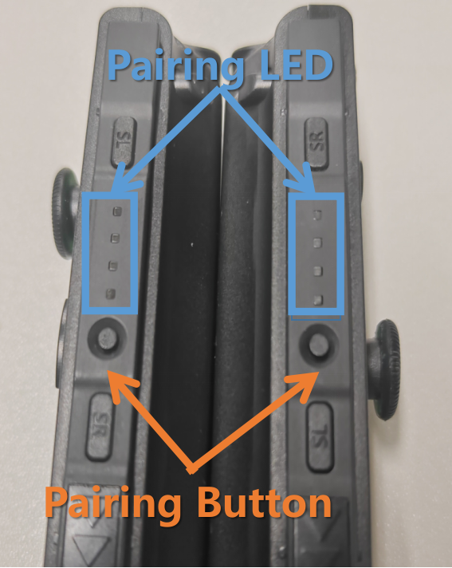
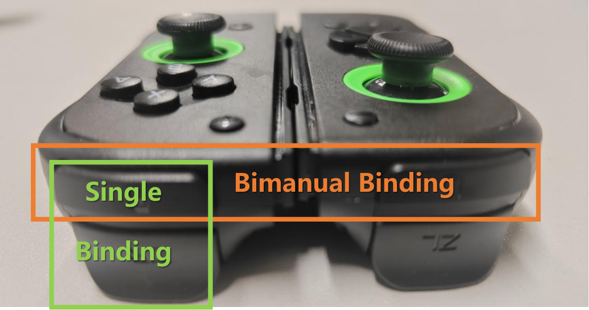
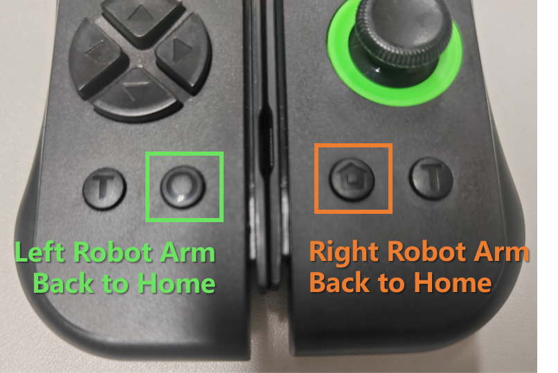

# Joycon-Robotics: Nintendo Switch Joy-Con for Robotics

## What's New?

- **February 24, 2025**: Added support for [Robosuite](https://github.com/box2ai-robotics/robosuite-joycon) controller

- **February 12, 2025**: Added support for [RLBench-ACT](https://github.com/box2ai-robotics/joycon-robotics) data collection

## Installation (Recommend Ubuntu 20.04, 22.04 with Bluetooth)

```bash
  git clone https://github.com/box2ai-robotics/joycon-robotics.git
  cd joycon-robotics
  
  pip install -e .
  sudo apt-get update
  sudo apt-get install -y dkms libevdev-dev libudev-dev
  make install
```

## Connection Setup

#### Initial Pairing
1. ​**First-time Bluetooth Pairing**:
   - Press and hold the small circular button on the side of the Joy-Con for 3 seconds to enter pairing mode.
   - On your computer, search for Bluetooth devices and select either `Joy-Con (R)` or `Joy-Con (L)` to complete pairing.
<p align="center">
  <picture>
    
  </picture>
</p>

2. ​**Connection Confirmation**:
   - Upon successful pairing, the controller will vibrate at a fixed frequency.
   - ​**Single-controller mode**: Hold both trigger buttons (ZL + ZR) for 3 seconds.
   - ​**Dual-controller mode**: After both controllers vibrate, simultaneously press:
     - Left Joy-Con's upper trigger (`L`) 
     - Right Joy-Con's upper trigger (`R`)
   - The system will allocate dedicated processes for connection monitoring.
<p align="center">
  <picture>
    
  </picture>
</p>

3. ​**Subsequent Connections**:
   - For already paired devices, simply press the upper trigger (`L`/`R`) to auto-reconnect.
   - A confirmation vibration will occur within 5 seconds. Follow Step 2 to finalize.

4. ​**Testing**: Refer to the [Quick Start Tutorial](joyconrobotics_tutorial.ipynb).


## Operational Manual

#### Coordinate System
- Home Position: `(0, 0, 0)`
- ​Front Direction: `X+` (end-effector facing)
- ​Right Direction: `Y+`
- ​Up Direction: `Z+`

#### Joystick Control (End-Effector POV)
- ``​↑``: Move forward along end-effector direction
- ``​↓``: Move backward along end-effector direction
- ``​←``: Strafe left (Y-)
- ``​→``: Strafe right (Y+)

#### Button Functions
<p align="center">
  <picture>
    
  </picture>
</p>

1. ​**Reset (Recommend)** 
   - Right Joy-Con `Home` button ​**or** Left Joy-Con `O` (Capture button): Return to home position.  
  
2. ​**Gripper Control**  
   - Right `ZR` ​**or** Left `ZL` (Lower triggers): Toggle gripper state:
     - Open → Close (when pressed)
     - Close → Open (when pressed)

3. ​**Height Adjustment**  
   - ``Joystick press (click down)``: Lower end-effector (`Z-`)  
   - `L`/`R` (Upper triggers): Raise end-effector (`Z+`)  

4. ​**Linear Movement**  
   - Left ``D-pad ↑`` ​**or** Right `X`: Move forward (`X+`)  
   - Left ``D-pad ↓`` ​**or** Right `B`: Move backward (`X-`)  

5. ​**Data Recording**  
   - Right `A`: Stop current dataset recording (requires custom implementation)  
   - Right `Y`: Restart current dataset recording (error recovery)  

#### Customization
- All other buttons are user-configurable.

## FAQ
### Connection Issues
#### Q1: Unable to connect / No vibration on successful connection
**Solution:**  
1. Re-run the `install` command to verify dependency installation  
2. Briefly press the pairing button to power off  
3. Remove the device from your computer's Bluetooth list  
4. Restart your computer  
5. Long-press the pairing button and reconnect via Bluetooth  

#### Q2: Frequent disconnections with unstable data
Solution: 
1. Charge the controller for 30 minutes (auto-shutdown indicates low battery)  
2. Restart both controller and computer  
   - *Note: Ubuntu has known Bluetooth compatibility issues*

### System Compatibility

#### Q1: Does it support Windows, VM, WSL or Mac?  
**A1:** Currently no - due to kernel-level driver requirements.  
Tested systems:  
- Ubuntu 20.04 LTS  
- Ubuntu 22.04 LTS  
*(Other systems may work but are unsupported)*

## More Info
1. You can follow the [bilibili video account](https://space.bilibili.com/122291348)
2. Join the discussion on the QQ group: 948755626
3. [Click here](https://item.taobao.com/item.htm?abbucket=16&detail_redpacket_pop=true&id=906794552661&ltk2=17440907659690jpsj3h7uiismft7vle37&ns=1&skuId=5933796995638) to buy the well-tuned version of the hardware.

If this project is helpful to you, please give us a star. We greatly appreciate it! ⭐ ⭐ ⭐ ⭐ ⭐


